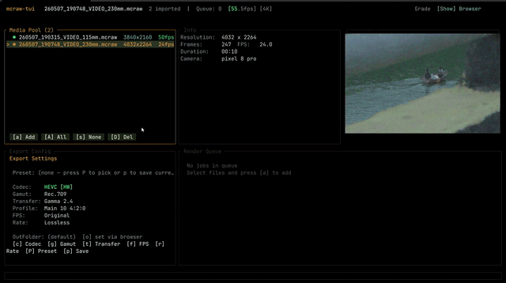

# mcraw-tui



Cross-platform terminal UI for browsing and exporting MotionCam `.mcraw` files to professional video formats.

## Features

- **Browser**: Navigate file system, import `.mcraw` files, view metadata (codec, resolution, FPS, white balance, camera make/model)
- **Media Pool**: Select files, preview details, batch operations
- **Render Queue**: Multi-file batch export with per-item status tracking
- **Export Settings**: 15 color spaces (Rec.709, S-Gamut3, ARRI WG, Canon Cinema Gamut, DaVinci Wide Gamut, ACES AP1, etc.), 14 transfer functions (S-Log3, C-Log3, ARRI LogC3/C4, PQ, HLG, etc.)
- **16 export codec profiles**: ProRes 4444/XQ, HEVC 10-bit 4:4:4, H.264, AV1 (SVT-AV1, NVENC), VP9, DNxHR
- **Hardware acceleration**: Auto-detects NVENC, AMF, QSV, VideoToolbox encoders
- **Pure Rust**: No C++ dependencies, no FFI

## Prerequisites

- **Rust** (edition 2021, no toolchain pin)
- **FFmpeg 5.0+** on `PATH` (required at runtime for video encoding)
- **motioncam-decoder-rust**: Clone alongside this repo (`git clone https://github.com/Yoganshbhatt/motioncam-decoder-rust ../motioncam-decoder-rust`)

## Install

```bash
cargo build --release
cargo run -- -f <file.mcraw>
```

### Headless export

```bash
cargo run -- export -f <file.mcraw> -F prores -o <outdir>
```

### View metadata

```bash
cargo run -- info -f <file.mcraw>
```

## Quick help

| Key | Action |
|-----|--------|
| `b` | Toggle file browser |
| `Tab` | Cycle focus: Media Pool → Queue → Export Settings |
| `Space` | Select / deselect items |
| `a` / `A` | Add selected / all to queue |
| `v` / `R` | Render selected / all |
| `c/g/t/p/r` | Cycle codec / gamut / transfer / profile / rate |
| `q` / `Esc` | Quit / close overlay |

Full keybinding reference available with `?`.

## License

Apache-2.0
